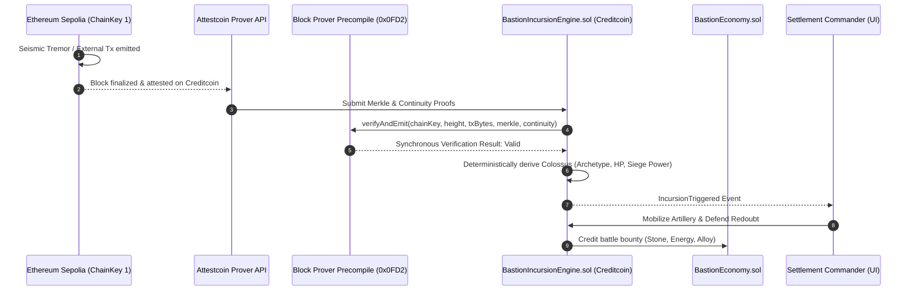

# 🛡️ BASTION: Provably Fair Frontier City-Builder
> **BUIDL CTC 2026 Fall Hackathon Submission — Gaming Track**  
> *Powered natively by Creditcoin's Attestcoin Protocol (`0x0FD2` Block Prover Precompile)*


---

## 🏰 Concept
**Bastion** is a real-time, 2D tactical settlement builder where players zone districts, construct stone ramparts, and position artillery towers to defend against colossal behemoths (**Colossi**). 

Unlike conventional Web2 and Web3 strategy games where threats are either scripted, client-side randomized (cheat-prone), or dependent on centralized oracles, **every incursion and economic shift in Bastion is cryptographically derived from attested external chain data (Ethereum Sepolia)** via Creditcoin's native **Block Prover Precompile (`0x0FD2`)**.

---

## ⚡ Why Attestcoin is Load-Bearing (Not Decorative)

* **Tamper-Proof Threat Waves:** An attacker cannot manipulate or predict incursion timing and Colossus strength by manipulating this contract's state alone—threat vectors trace directly back to verified external chain events.
* **Synchronous Single-Block Latency:** Proof verification executes natively in Rust inside the Creditcoin node via `0x0FD2`, completing in **1 block (~15s)**.
* **Negligible Cost:** The precompile operates on a linear formula:
  $$\text{CTC Cost} \approx 2.3 \times 10^{-5} + 2.9 \times 10^{-7} \times (\text{continuityHashCount}) \text{ CTC}$$
  ($< \$0.0001 \text{ USD}$ per verification).
* **Replay Protection:** Built-in cryptographic hash verification (`txKey`) prevents replaying historical transactions.

---

## 🔄 Core Game Loop & Architecture



---

## 🎯 Attestcoin Integration Phases

### ✅ Phase 1 (MVP, Must-Have): Attested Incursion Trigger
- `INativeQueryVerifier.sol`: Canonical Solidity interface for the `0x0FD2` precompile.
- `BastionIncursionEngine.sol`: Replay-protected ASC that calls `verifyAndEmit()`, deterministically derives Colossus archetypes (*Mountainbreaker*, *Dread Strider*, *Ironclad Gorger*, *Tempest Goliath*), and manages combat resolution.
- `SeismicBeacon.sol`: Companion source chain contract on Ethereum Sepolia.

### ✅ Phase 2: Attested Resource Economy
- `BastionEconomy.sol`: Dynamic in-game resource scarcity (Raw Stone, Sunstone Energy, Garrison Grain, Aegis Alloy) tied to cross-chain market volatility and tremor activity.

### ✅ Phase 3 (Stretch): Attested Structure State NFTs
- `BastionStructures.sol`: ERC-721 tokenized defense fortifications (Ramparts, Ballistas, Sunstone Pylons) recording immutable state attestation hashes (`Intact`, `Damaged`, `Destroyed`), making structure condition queryable and verifiable across games without a bridge.

---

## 🚀 Quickstart & Verification

### 1. Run Automated Unit Tests (16 Tests)
```bash
npx hardhat test
```

### 2. Run End-to-End Incursion Simulation
```bash
npx hardhat run scripts/demo-incursion.js
```

### 3. Deploy Contracts
```bash
# Local development node
npx hardhat run scripts/deploy.js

# Creditcoin CC3 Testnet
npx hardhat run scripts/deploy.js --network creditcoinTestnet
```

### 4. Launch 2D Tactical Web Client
```bash
cd client
npm install
npm run dev
```
Open browser to `http://localhost:5173`.

---

## 📋 Network & Contract Addresses

| Component | Network | Address / Value |
| :--- | :--- | :--- |
| **Creditcoin Testnet RPC** | Creditcoin CC3 | `https://rpc.cc3-testnet.creditcoin.network/` |
| **Chain ID** | Creditcoin CC3 | `102031` (`0x18E8F`) |
| **Currency** | Creditcoin CC3 | `tCTC` |
| **Block Prover Precompile** | Creditcoin CC3 | `0x0000000000000000000000000000000000000FD2` |
| **Incursion Engine (ASC)** | Creditcoin CC3 | `0xe7f1725E7734CE288F8367e1Bb143E90bb3F0512` |
| **Economy Engine** | Creditcoin CC3 | `0x9fE46736679d2D9a65F0992F2272dE9f3c7fa6e0` |
| **Structures NFT (ERC-721)**| Creditcoin CC3 | `0xCf7Ed3AccA5a467e9e704C703E8D87F634fB0Fc9` |
| **Seismic Beacon** | Sepolia | `0x5FC8d32690cc91D4c39d9d3abcBD16989F875707` |

---

## 📚 Documentation & Deliverables
* 📊 [Pitch Deck & Presentation (10 Slides)](docs/PITCH_DECK.md)
* 🏛️ [Technical Architecture Deep-Dive](docs/ARCHITECTURE.md)
* 🧪 [Judge Testing & Demo Guide](docs/DEMO_GUIDE.md)

---

## ⚖️ IP & Fair Use Compliance
*Bastion* is an original intellectual property inspired by survival defense fiction. It does **NOT** use any trademarked characters, terminology, or assets from *Attack on Titan* or any other commercial franchise. All creature archetypes (*Colossi: Mountainbreaker, Dread Strider, Ironclad Gorger, Tempest Goliath*), locations (*The Redoubt of Bastion*), and structures are 100% original.
