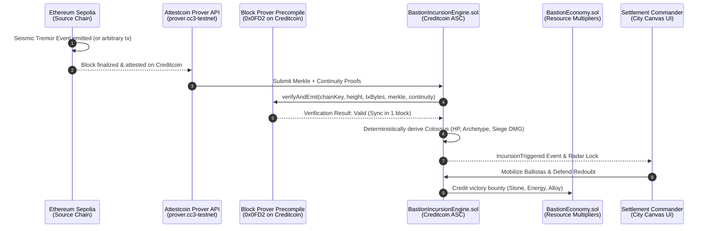

# BASTION: Provably Fair Frontier City-Builder
### BUIDL CTC 2026 Fall Hackathon Submission — Gaming Track
**Powered by the Attestcoin Protocol on Creditcoin**

---

## Slide 1: Cover & Vision
* **Project Name:** Bastion
* **Tagline:** Build the Redoubt. Weather the Colossi. Provably fair survival powered by Creditcoin's native Attestcoin Protocol.
* **Track:** Gaming Track (BUIDL CTC 2026 Fall)
* **Core Innovation:** Cross-chain threat derivation and dynamic resource economy anchored directly to external layer-1 blockchain state without centralized oracles.

---

## Slide 2: The Problem with Web3 & Strategy Gaming
1. **Client-Side Cheatability:** Traditional strategy/survival games simulate world events client-side or on private servers. Players can manipulate memory, inspect PRNG states, or predict wave timing.
2. **The Centralized Oracle Vulnerability:** Most Web3 games that claim "external randomness" rely on centralized oracle nodes or multi-sig bridges. If the oracle goes down or acts maliciously, game state can be exploited or stalled.
3. **Cosmetic Cross-Chain Tokens:** Most multi-chain games merely bridge tokens; the gameplay itself is completely isolated on a single chain with no awareness of the broader multi-chain world.

---

## Slide 3: The Solution — Bastion
* **Bastion** is a real-time, 2D tactical settlement builder where players zone districts, construct stone ramparts, and position artillery towers to defend against colossal behemoths (**Colossi**).
* **Load-Bearing Attestcoin Integration:**
  * Incursions are **not** scripted by the game developer.
  * Incursions are **not** randomized client-side.
  * Threat waves, Colossus archetypes, and siege severity are **cryptographically derived from attested Ethereum Sepolia transactions** via Creditcoin's native Block Prover Precompile (`0x0FD2`).
* An attacker cannot predict or manipulate wave timings without altering the historical state of the source blockchain itself.

---

## Slide 4: Why Attestcoin is Load-Bearing (Not Decorative)
| Dimension | Traditional Web3 Game | Bastion with Attestcoin |
| :--- | :--- | :--- |
| **Threat Generation** | Centralized server / pseudo-RNG | Cryptographically attested foreign blocks |
| **Verification Speed** | Multi-block relay or off-chain oracle | Synchronous single-block verification (~15s) |
| **Trust Model** | Trust in oracle operator | Trustless consensus proof validated in Rust precompile |
| **Gas Cost** | Expensive oracle callback tx fees | Ultra-low precompile cost (~0.000025 CTC / query) |
| **Replay Protection** | Often vulnerable to double-spending | Native `txKey` replay prevention in contract |

---

## Slide 5: System Architecture

---

## Slide 6: The Game Loop & Mechanics
1. **Zoning & Fortification:** Players construct Aegis Ramparts, Ballista Bastions, and Sunstone Batteries on a 12x12 tactical settlement grid.
2. **Attested Threat Radar:** Seismic telemetry from Ethereum Sepolia is monitored. When an attested tremor is verified on Creditcoin, a Colossus marches on the city.
3. **Deterministic Colossus Archetypes:**
   - **Mountainbreaker:** Heavy blunt siege, batters outer ramparts.
   - **Dread Strider:** High agility walker, targets artillery towers.
   - **Ironclad Gorger:** Heavily plated beast, devours settlement food & ore.
   - **Tempest Goliath:** Electrical titan, disrupts sunstone defense grid.
4. **Artillery Defense:** Towers open fire with kinetic bolts and plasma arcs. Repelling the beast earns rare bounties; failing to defend results in outer wall breaches.

---

## Slide 7: What Was Built (BUIDL CTC 2026 Deliverables)
* **Phase 1 (MVP — Complete & Verified):**
  - Canonical `INativeQueryVerifier.sol` matching Precompile `0x0FD2`.
  - `BastionIncursionEngine.sol`: Replay-protected ASC triggering deterministic Colossi incursions from Sepolia proofs.
  - Companion `SeismicBeacon.sol` on Sepolia.
  - End-to-end demo script `scripts/demo-incursion.js`.
* **Phase 2 (Complete & Verified):**
  - `BastionEconomy.sol`: Cross-chain market volatility engine tying stone, energy, and food scarcity to attested telemetry.
* **Phase 3 (Stretch — Complete & Verified):**
  - `BastionStructures.sol`: ERC-721 tokenized ramparts and defense towers with verifiable state attestation hashes (`Intact`, `Damaged`, `Destroyed`).
* **Tactical UI:**
  - Modern React + Tailwind 2D Canvas city builder, seismic radar, and interactive Attestcoin Proof Inspector.

---

## Slide 8: Technical Validation & Gas Economics
* **16 Passing Automated Tests:** Covering replay prevention, proof validation, invalid proof rejection, combat resolution, market volatility, and NFT state updates.
* **Official Creditcoin Precompile Gas Formula:**
  $$\text{CTC Cost} \approx 2.3 \times 10^{-5} + 2.9 \times 10^{-7} \times (\text{continuityHashCount}) \text{ CTC}$$
  - For a typical 2-checkpoint query: $\approx 0.0000236$ tCTC ($< \$0.0001$).
  - Fast, synchronous 1-block execution ($\sim 15$ seconds), enabling fluid real-time tactical gameplay.

---

## Slide 9: Future Work & Roadmap
* **Multi-Settlement Guild Alliances:** Multiple Bastion cities pooling defense power against mega-Colossi incursions.
* **Cross-Chain Governance (Future Work):** Decentralized frontier council voting on wall reinforcement subsidies and tax rates across multi-chain treasuries.
* **Autonomous Oracle Relayers:** Automated worker bots listening to Sepolia events and submitting proofs to Creditcoin on behalf of players.
* **Mobile / PWA Client:** Touch-optimized canvas renderer for mobile commanders.

---

## Slide 10: Conclusion & Links
* **Bastion proves that Attestcoin transforms Web3 gaming:** cross-chain data is no longer just for token bridging—it is the cryptographic heartbeat of the game world.
* **Repository:** [GitHub / Gluwa BUIDL CTC 2026 Submission]
* **Creditcoin Testnet Contracts:**
  - Block Prover Precompile: `0x0000000000000000000000000000000000000FD2`
  - Incursion Engine (ASC): `0xe7f1725E7734CE288F8367e1Bb143E90bb3F0512`
  - Economy Contract: `0x9fE46736679d2D9a65F0992F2272dE9f3c7fa6e0`
  - Structures NFT: `0xCf7Ed3AccA5a467e9e704C703E8D87F634fB0Fc9`
